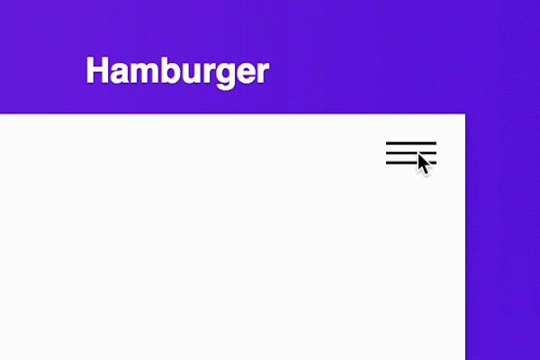

# animate-ui

A library of animated UI React elements built with Julian Garnier's [Anim.js](https://github.com/juliangarnier/anime).

### Components

- [Toggle](#toggle)
- [Hamburger](#hamburger)
- [Submit Button](#submit)
- [Dot Loader](#dotLoader)
- [Circle Loader](#circleLoader)
- [Placeholder Card](#placeholderCard)
- [TEST](#test)

## Toggle


```js
import { Toggle } from 'animate-ui';
```

## Hamburger



```js
import { Hamburger } from 'animate-ui';
```

## Submit Button


```js
import { SubmitButton } from 'animate-ui';
```

## Dot Loader


```js
import { DotLoader } from 'animate-ui';
```

## Circle Loader


```js
import { CircleLoader } from 'animate-ui';
```

## Placeholder Card


```js
import { Placeholder } from 'animate-ui';
```
